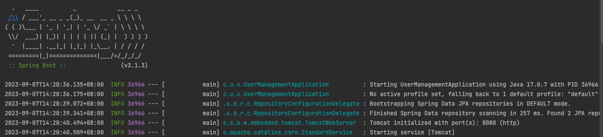
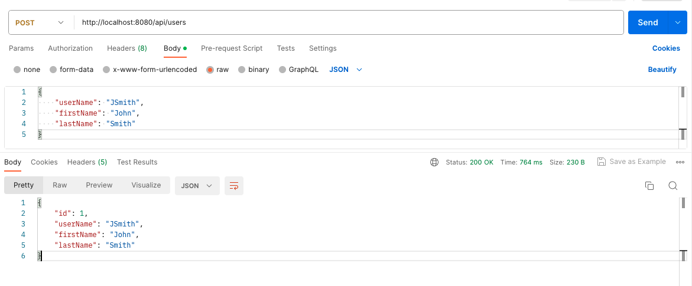

# User Tasks Management (Client applications assessments)
A backend system that will perform basic CRUD operations.

## Libraries/Tools Used
 - Java 17
 - Maven
 - Spring Boot with the following components:
   - Spring Web
   - Spring Data JPA
 - Embedded database using H2
 - Lombook
 - Mapstruct

## **A. Run the Spring Boot application**

    1. Go to UserManagementApplication
    2. Right-click then select Run/Debug.
    3. This will run the Spring Boot application - below is the expected logs at startup.




## B. Test REST API using Postman or curl
### B.1. User Management

###### Create a User
```
curl --location --request POST 'http://localhost:8080/api/users' \
--header 'Content-Type: application/json' \
--data-raw '{
    "username": "jsmith",
    "firstName": "John",
    "lastName": "Smith"
}'
```

###### Update User
```
curl --location --request PUT 'http://localhost:8080/api/users/{id}' \
--header 'Content-Type: application/json' \
--data-raw '{
    "firstName": "John",
    "lastName": "Doe"
}'
```
###### List all users
```
curl --location --request GET 'http://localhost:8080/api/users'
```
###### Get User info
```
curl --location --request GET 'http://localhost:8080/api/users/{id}'
```
### B.2. Task Management

###### Create Task
```
curl --location --request POST 'http://localhost:8080/api/users/{id}/tasks' \
--header 'Content-Type: application/json' \
--data-raw '{
    "name": "My task",
    "description": "Description of task",
    "dateTime": "2016-05-25 14:25:00"
}'
```
###### Update Task
```
curl --location --request PUT 'http://localhost:8080/api/users/tasks/{task_id}' \
--header 'Content-Type: application/json' \
--data-raw '{"name":"My updated task"}'
```

###### Delete Task
```
curl --location --request DELETE 'http://localhost:8080/api/users/tasks/{task_id}'
```
###### Get Task Info
```
curl --location --request GET 'http://localhost:8080/api/users/tasks/{task_id}'
```
###### List all tasks for a user
```
curl --location --request GET 'http://localhost:8080/api/users/{user_id}/tasks'
```

###### Sample Postman create user response;
